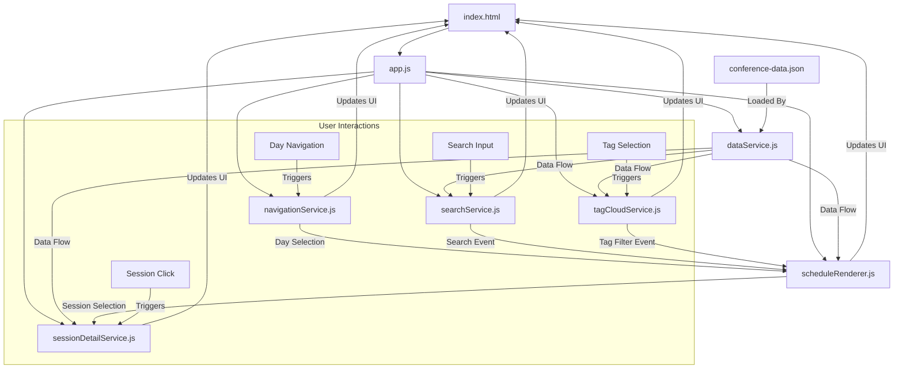

# Conference Application Architecture

This document outlines the architecture and technical design of the Conference Schedule Application, explaining the modular structure, component relationships, and design patterns used in the implementation.

## Project Structure

```
conference-app/
├── index.html                # Main HTML entry point
├── src/
│   ├── css/
│   │   └── styles.css        # Application styles
│   ├── data/
│   │   └── conference-data.json  # Mock conference data
│   └── js/
│       ├── app.js            # Main application entry point
│       └── modules/          # ES modules for functionality separation
│           ├── dataService.js        # Data fetching and processing
│           ├── scheduleRenderer.js   # Schedule UI rendering
│           ├── navigationService.js  # Day navigation handling
│           ├── searchService.js      # Search functionality
│           └── sessionDetailService.js  # Session modal handling
```

## Architectural Approach

The application follows a modular architecture with clear separation of concerns, using ES Modules to organize and encapsulate functionality. We've implemented a component-based approach where each module handles a specific aspect of the application's functionality.

### Key Design Principles

1. **Modularity**: Each JavaScript module has a single responsibility
2. **Event-Driven Communication**: Components communicate through custom events
3. **Progressive Enhancement**: Core functionality works without JavaScript, enhanced with JS
4. **Accessibility First**: Built with keyboard navigation and ARIA attributes
5. **No External Dependencies**: Pure JavaScript implementation without frameworks

## Core Modules

### 1. App (app.js)

The main entry point that initializes the application, loads data, and coordinates between modules.

**Responsibilities**:
- Loading conference data from JSON
- Initializing all UI components
- Error handling for application-level issues

### 2. Data Service (dataService.js)

Handles data fetching and processing for the conference schedule.

**Responsibilities**:
- Fetching conference data from JSON file
- Providing methods to access and filter session data
- Data transformation and preparation for rendering

**Key Methods**:
- `fetchConferenceData()`: Loads the conference data JSON file
- `getAllSessions()`: Returns all sessions across all days
- `getSessionsByDay(dayId)`: Returns sessions filtered by day
- `getSessionById(sessionId)`: Returns a specific session by ID

### 3. Schedule Renderer (scheduleRenderer.js)

Manages the rendering of conference schedule in the UI.

**Responsibilities**:
- Creating DOM elements for schedule days, time slots, and sessions
- Implementing click handlers for session elements
- Updating the active day in the schedule view

**Key Methods**:
- `renderSchedule(conferenceData)`: Renders the complete schedule
- `setActiveDay(dayId)`: Changes which day's schedule is displayed
- `createSessionElement(session)`: Creates interactive session cards

### 4. Navigation Service (navigationService.js)

Manages the day navigation tabs and their functionality.

**Responsibilities**:
- Setting up tab navigation between conference days
- Handling tab click events
- Updating active tab styling

**Key Methods**:
- `setupTabNavigation(conferenceData)`: Sets up day navigation tabs
- `handleDaySelection(dayId)`: Handles day selection logic
- `updateActiveTab(dayId)`: Updates the active tab styling

### 5. Search Service (searchService.js)

Implements search functionality for finding sessions.

**Responsibilities**:
- Processing search input from users
- Filtering sessions based on search criteria
- Displaying search results in the UI

**Key Methods**:
- `setupSearch(conferenceData)`: Initializes search functionality
- `performSearch(searchTerm)`: Executes search against all sessions
- `displaySearchResults(results)`: Shows search results in the UI

### 6. Session Detail Service (sessionDetailService.js)

Handles the display of detailed session information in a modal popup.

**Responsibilities**:
- Creating and populating the session detail modal
- Managing modal open/close behavior
- Handling keyboard navigation and accessibility

**Key Methods**:
- `setupSessionDetails(conferenceData)`: Sets up event listeners for session selection
- `showSessionDetails(sessionId, conferenceData)`: Displays details for selected session
- `hideSessionDetails()`: Closes the session detail modal

## Architecture Visualization



## Communication Pattern

The application uses a custom event system for communication between modules:

1. User interacts with a UI element (e.g., clicks a session)
2. The module handling that element dispatches a custom event (e.g., `session-selected`)
3. Other modules listen for these events and respond accordingly

Example:
```javascript
// In scheduleRenderer.js - Dispatching an event
sessionElement.addEventListener('click', () => {
    const event = new CustomEvent('session-selected', {
        detail: { sessionId: session.id }
    });
    document.dispatchEvent(event);
});

// In sessionDetailService.js - Listening for the event
document.addEventListener('session-selected', (event) => {
    const sessionId = event.detail.sessionId;
    showSessionDetails(sessionId, conferenceData);
});
```

## Data Flow

1. **Data Loading**: The app.js module loads conference data from the JSON file using dataService.js
2. **Rendering**: The data is passed to various modules for rendering the UI
3. **User Interaction**: Users interact with rendered elements
4. **Event Dispatching**: User actions trigger custom events
5. **State Updates**: Modules update their state based on these events
6. **UI Updates**: The UI is updated to reflect state changes

## Styling Approach

The application uses a single CSS file with these principles:

1. **CSS Variables**: For consistent colors, spacing, and other design values
2. **Mobile-First Design**: Core layouts work on mobile, enhanced for larger screens
3. **Component-Based Classes**: CSS classes match the component structure
4. **Minimal Dependencies**: No external CSS frameworks are used

## Accessibility Considerations

1. **Semantic HTML**: Using appropriate HTML elements for their semantic meaning
2. **Keyboard Navigation**: All interactive elements are keyboard accessible
3. **ARIA Attributes**: Used for improved screen reader support
4. **Focus Management**: Proper focus handling in the modal dialog
5. **Color Contrast**: Ensuring readable text with sufficient contrast ratios

## Performance Considerations

1. **Minimal DOM Manipulations**: Building elements efficiently before adding to DOM
2. **Event Delegation**: Using event bubbling where appropriate
3. **Debouncing**: Implementing debounce for search functionality
4. **Code Splitting**: Using ES Modules for better code organization and loading
5. **Lazy Loading**: Creating UI components only when needed

## Extension Points

The application architecture supports several extension points:

1. **Additional Data Sources**: The dataService.js module can be extended to support remote APIs
2. **New UI Components**: Additional modules can be created for new features
3. **Filtering Options**: The search functionality can be extended with advanced filters
4. **Personalization**: User preferences could be stored in localStorage
5. **Authentication**: The app structure supports adding user authentication

## Design Decisions

### Why ES Modules?

ES Modules were chosen for their native browser support, clean import/export syntax, and ability to create well-encapsulated code without the need for a build step.

### Why Custom Events?

Custom events provide a simple yet effective way for modules to communicate without tight coupling, allowing for a more maintainable and testable codebase.

### Why No Framework?

For this specific application, the complexity level didn't warrant the overhead of a framework. The pure JavaScript approach provides better learning opportunities and avoids unnecessary dependencies.
